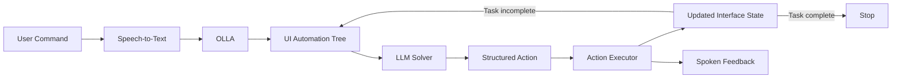

# OLLA

[](https://2026.emnlp.org/)


**OLLA** is a screen-reader-accessible interaction layer for computer-use agents (CUAs), designed to support blind users in completing desktop tasks through natural-language commands and nonvisual feedback.

This repository accompanies our **EMNLP 2026 Main Conference** paper:

> **Are We There Yet? Assessing Computer-Use Agents for Blind Users' Accessible Interaction with Desktop Applications**  
> Satwik Ram Kodandaram, Monalika Padma Reddy, Xiaojun Bi, Jiawei Zhou, I. Ramakrishnan, and Vikas Ashok  
> *The 2026 Conference on Empirical Methods in Natural Language Processing (EMNLP 2026), Main Conference*  
> **Budapest, Hungary · October 24–29, 2026 · HUNGEXPO**

**Paper:** [OpenReview](https://openreview.net/forum?id=3aPqf9cfWU)  
**Conference:** [EMNLP 2026](https://2026.emnlp.org/)

---

## Citation

If you use OLLA in your research, please cite:

```bibtex
@inproceedings{kodandaram2026arewethereyet,
  title     = {Are We There Yet? Assessing Computer-Use Agents for Blind Users' Accessible Interaction with Desktop Applications},
  author    = {Kodandaram, Satwik Ram and Padma Reddy, Monalika and Bi, Xiaojun and Zhou, Jiawei and Ramakrishnan, I. and Ashok, Vikas},
  booktitle = {Proceedings of the 2026 Conference on Empirical Methods in Natural Language Processing},
  year      = {2026},
  address   = {Budapest, Hungary},
  publisher = {Association for Computational Linguistics}
}
```

The citation will be updated with the final ACL Anthology identifier and page numbers after publication.

---

## Overview

Computer-use agents combine language reasoning with interface grounding to operate graphical user interfaces. However, most existing CUAs assume visually mediated interaction, requiring users to monitor screenshots, interface changes, or agent actions.

OLLA provides an accessibility layer that enables blind screen-reader users to interact with CUAs nonvisually. Users can issue natural-language commands, receive spoken feedback about agent actions, and interact with desktop applications without directly monitoring the graphical interface.

OLLA is **not a new CUA reasoning architecture**. It provides an accessible interaction and execution layer around an underlying computer-use agent while preserving the agent's reasoning process.

The current implementation integrates:

- natural-language and speech-based task input;
- Microsoft UI Automation for observing desktop interfaces;
- language-model-based interface reasoning;
- structured UI-action generation;
- programmatic action execution using `pywinauto`;
- interaction history across execution steps; and
- text-to-speech feedback for nonvisual interaction.

In the accompanying study, OLLA supported a three-week longitudinal deployment with **8 blind screen-reader users**, yielding **1,258 participant-issued commands across 12 desktop applications**.

---

## System Architecture

OLLA follows an iterative **observe–reason–act** interaction loop:



At each execution step:

1. OLLA observes the current desktop interface through Microsoft UI Automation.
2. The participant-issued command, current UI tree, and recent interaction history are provided to the solver.
3. The solver reasons over the observed interface state and selects an appropriate UI control.
4. The solver generates a structured action.
5. OLLA executes the action through the UI Automation layer.
6. The resulting application state is observed again.
7. Execution continues until the task is determined to be complete.

The repository also contains an auxiliary reviewer module for examining solver-generated actions against the current interface state and recent interaction history.

---

## Repository Structure

```text
OLLA-main/
├── main.py                         # Main orchestration and interaction loop
├── llm.py                          # Solver model and interaction state
├── reviewer.py                     # Optional action-verification agent
├── utils.py                        # Shared utilities
│
├── agents/
│   ├── solver/
│   │   ├── prompt.py               # Solver system prompt
│   │   ├── few_shot_examples.py    # Few-shot interaction examples
│   │   ├── output.py               # Structured output examples
│   │   └── ui_tree.py              # UI-tree examples
│   │
│   └── reviewer/
│       └── prompt.py               # Reviewer prompt
│
├── ui_automation/
│   └── ui_manager.py               # UI-tree extraction and action execution
│
├── speech/
│   ├── stt.py                      # Faster-Whisper speech-to-text
│   ├── tts.py                      # Text-to-speech feedback
│   └── hotkey.py                   # Global hotkey support
│
├── package/
│   ├── tray.py                     # Windows system-tray interface
│   └── build.txt                   # PyInstaller build command
│
├── assets/
│   ├── olla_tray.ico
│   └── speech/
│       └── models/
│           └── small/              # Local Faster-Whisper model
│
├── pyproject.toml
├── poetry.lock
└── README.md
```

### Core Modules

| Module | Role |
|---|---|
| `main.py` | Coordinates speech input, interface observation, model calls, action execution, and task progression. |
| `llm.py` | Initializes the solver and maintains interaction history using LangChain/LangGraph. |
| `reviewer.py` | Implements the optional action-verification agent. |
| `agents/solver/` | Contains the solver prompt, few-shot examples, output definitions, and UI-tree examples. |
| `agents/reviewer/` | Contains the reviewer prompt used for action verification. |
| `ui_automation/ui_manager.py` | Connects to Windows applications through Microsoft UI Automation, extracts controls, captures interface state, and executes actions. |
| `speech/stt.py` | Implements local speech recognition using Faster-Whisper. |
| `speech/tts.py` | Provides spoken feedback. |
| `speech/hotkey.py` | Implements global keyboard hotkey handling. |
| `package/tray.py` | Provides the optional Windows system-tray interface. |

---

## Requirements

OLLA currently targets **Windows desktop applications** because its interface-observation and action-execution layer relies on Microsoft UI Automation.

### System Requirements

- Windows 10 or Windows 11
- Python `>=3.11,<3.15`
- Poetry
- A working microphone
- An OpenAI API key for the current model backend
- A desktop application exposing controls through Microsoft UI Automation

Speech recognition is performed locally using Faster-Whisper.

The bundled speech model is located at:

```text
assets/speech/models/small/
```

---

## Installation

### 1. Clone the Repository

```bash
git clone <YOUR-REPOSITORY-URL>
cd OLLA-main
```

### 2. Install Dependencies

OLLA uses Poetry for dependency management.

```bash
poetry install
```

---

## Environment Configuration

OLLA loads configuration values from a `.env` file using `python-dotenv`.

Create a `.env` file in the repository root:

```env
OPENAI_API_KEY=your_openai_api_key
MODEL=your_model_identifier
SPEECH_MODEL=small
```

### Environment Variables

| Variable | Required | Used By | Description |
|---|---:|---|---|
| `OPENAI_API_KEY` | Yes | OpenAI/LangChain integration | API key used to authenticate requests to the configured OpenAI model. |
| `MODEL` | Yes | `llm.py`, `reviewer.py` | Model identifier passed to the model initialization logic for the solver and reviewer. |
| `SPEECH_MODEL` | Optional | `main.py` | Speech-model configuration passed when initializing speech recognition. |

Example:

```env
OPENAI_API_KEY=sk-...
MODEL=<model-id>
SPEECH_MODEL=small
```

### Note on `SPEECH_MODEL`

Although `main.py` reads the `SPEECH_MODEL` environment variable, the current implementation in `speech/stt.py` directly loads the bundled Faster-Whisper model from:

```text
assets/speech/models/small/
```

Therefore, changing:

```env
SPEECH_MODEL=...
```

does **not currently change the underlying speech-recognition checkpoint** unless the loading logic in `speech/stt.py` is also modified.

### Protecting API Credentials

Do not commit `.env` to the repository.

Add:

```gitignore
.env
```

to `.gitignore`.

A safe `.env.example` can be included instead:

```env
OPENAI_API_KEY=
MODEL=
SPEECH_MODEL=small
```

Users can then create their local configuration on Windows using:

```powershell
copy .env.example .env
```

---

## Running OLLA

Start OLLA using:

```bash
poetry run python main.py
```

The current `UIManager` connects to the active Windows application.

Before starting OLLA, bring the application you want OLLA to interact with to the foreground.

---

## Using OLLA

### Voice Interaction

The current implementation uses **F9** to control speech recording.

1. Bring the target application to the foreground.
2. Start OLLA.
3. Press and release **F9** to begin recording.
4. Speak a natural-language desktop command.
5. Press and release **F9** again to stop recording.
6. OLLA transcribes the command locally.
7. OLLA extracts the current Microsoft UI Automation tree.
8. The solver identifies an appropriate interface control.
9. OLLA provides spoken feedback and executes the generated action.
10. If the task is incomplete, OLLA observes the updated interface state and continues execution.

Example:

```text
Change the font size to 10.
```

---

## Interface Observation

OLLA uses Microsoft UI Automation to obtain a structured representation of the active application's interface.

The extracted UI information can include:

- control names;
- control types;
- interface hierarchy;
- bounding rectangles; and
- other properties exposed through UI Automation.

This representation allows the solver to ground its actions in the current application state.

The `UIManager` also includes support for screenshot capture. In the current execution loop, solver actions are primarily grounded using the UI Automation representation.

---

## Structured Agent Output

At each execution step, the solver produces a structured JSON action.

Example:

```json
{
  "found": "Yes",
  "control_type": "Edit",
  "title": "Font Size",
  "value": "10",
  "rect": {
    "left": 0,
    "top": 0,
    "right": 0,
    "bottom": 0
  },
  "reason": "The Font Size control corresponds to the requested formatting operation.",
  "complete": "Yes"
}
```

### Output Fields

| Field | Description |
|---|---|
| `found` | Whether a relevant interface control was identified. |
| `control_type` | Microsoft UI Automation control type. |
| `title` | Name or label of the selected UI control. |
| `value` | Value or text to enter when applicable. |
| `rect` | Bounding rectangle associated with the selected control. |
| `reason` | Model rationale for selecting the control. |
| `complete` | Whether the solver considers the requested task complete. |

For editable controls, OLLA can focus the target and enter the requested value. Other supported controls can be activated through UI Automation operations such as `click_input()`.

---

## Interaction History

OLLA maintains interaction history across execution steps.

This allows the solver to reason over:

- the participant's original command;
- previously attempted actions;
- previously selected controls;
- changes in application state; and
- whether additional actions are required.

The system therefore supports multi-step interaction rather than treating each UI action independently.

---

## Reviewer Module

OLLA includes an auxiliary reviewer implemented in:

```text
reviewer.py
```

The reviewer can examine a proposed solver action together with the current UI tree and interaction history.

It can help identify:

- potentially incorrect control selections;
- redundant actions;
- repeated actions; and
- non-progressing interaction patterns.

The reviewer is implemented separately from the primary solver.

---

## Speech Recognition

Speech-to-text is implemented in:

```text
speech/stt.py
```

OLLA uses **Faster-Whisper** for local speech recognition.

The bundled model is stored at:

```text
assets/speech/models/small/
```

Speech recognition therefore occurs locally before the transcribed natural-language command is provided to the agent.

---

## Text-to-Speech Feedback

Text-to-speech functionality is implemented in:

```text
speech/tts.py
```

Spoken feedback allows users to monitor system state and agent actions without visually inspecting the application.

---

## Building the Windows Executable

The repository includes the PyInstaller configuration used for packaging OLLA in:

```text
package/build.txt
```

A representative build command is:

```powershell
poetry run pyinstaller `
  --name OLLA `
  --onefile `
  --noconsole `
  --hidden-import=pythoncom `
  --hidden-import=pywintypes `
  --collect-all faster_whisper `
  --collect-all ctranslate2 `
  --collect-all numpy `
  --collect-binaries sounddevice `
  --collect-binaries soundfile `
  --exclude-module numpy.f2py.tests `
  --add-data "speech/models;speech/models" `
  --add-data "assets;assets" `
  --icon "assets/olla_tray.ico" `
  main.py
```

The generated executable is written to:

```text
dist/OLLA.exe
```

---

## Research Context

OLLA was developed to enable the study of computer-use agents under authentic nonvisual desktop interaction.

The accompanying **EMNLP 2026 Main Conference** paper investigates:

1. how effectively CUAs support blind users in completing everyday, real-world computer tasks;
2. where CUAs break down during nonvisual task execution and what these breakdowns reveal about current agent limitations; and
3. how blind users envision CUAs supporting everyday computer use beyond end-to-end automation.

We conducted an IRB-approved three-week longitudinal deployment with **8 blind screen-reader users**.

Participants used OLLA during regular desktop activities rather than completing only predefined laboratory tasks.

The deployment yielded:

- **1,258 participant-issued commands**
- **12 desktop applications**
- **304 normalized task intents**
- screenshots
- Microsoft UI Automation trees
- model responses
- generated actions
- interaction histories

The paper additionally evaluates the same participant-issued commands across multiple computer-use models under controlled conditions.

Please refer to the paper for the full study protocol, model configurations, annotation methodology, statistical analysis, and empirical findings.

---

## Accessibility

OLLA was designed specifically for nonvisual interaction with computer-use agents.

The system incorporates:

- screen-reader-compatible interaction;
- keyboard-based activation;
- natural-language commands;
- speech input;
- spoken feedback; and
- nonvisual monitoring of agent execution.

These accessibility mechanisms enable blind users to interact with the underlying CUA but do not modify the underlying model's reasoning process.

---

## Privacy and Safety

OLLA is a **research prototype**, not a production automation system.

Agent-generated actions can modify:

- application state;
- documents;
- application settings;
- files; and
- other interface content.

We recommend testing OLLA first on reversible tasks and non-sensitive data.

Depending on the configured model backend, information provided to the model may include:

- the participant-issued command;
- UI Automation control names;
- interface structure;
- application or document text exposed through UI Automation; and
- recent interaction history.

UI Automation trees may therefore contain sensitive application information.

Researchers and users should review the privacy requirements of their deployment environment and configured model provider before using OLLA with sensitive information.

Speech recognition is performed locally using Faster-Whisper in the current implementation.

---

## Authors

**Satwik Ram Kodandaram** — Stony Brook University  
**Monalika Padma Reddy** — Stony Brook University  
**Xiaojun Bi** — Stony Brook University  
**Jiawei Zhou** — Stony Brook University  
**I. Ramakrishnan** — Stony Brook University  
**Vikas Ashok** — Old Dominion University

---

## License

This project is released under the **MIT License**.

---

## Acknowledgments

We thank the blind participants who contributed their time and experiences to this research.

OLLA builds on open-source tools and libraries including LangChain, LangGraph, `pywinauto`, Faster-Whisper, `pyttsx3`, and Microsoft UI Automation.
